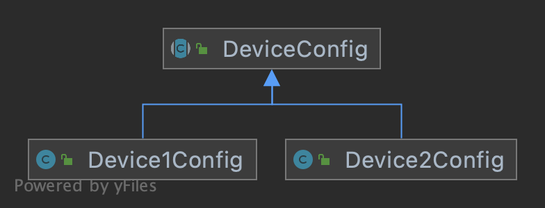
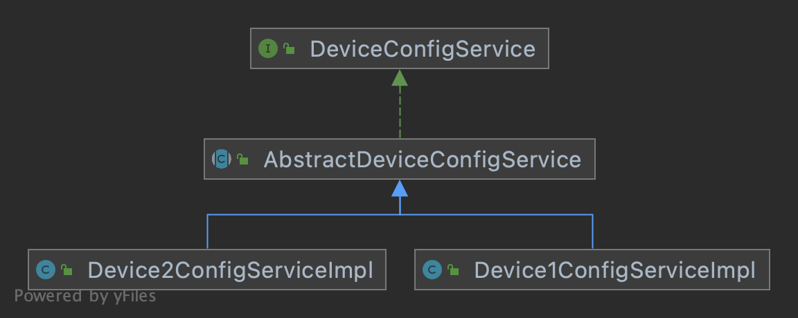
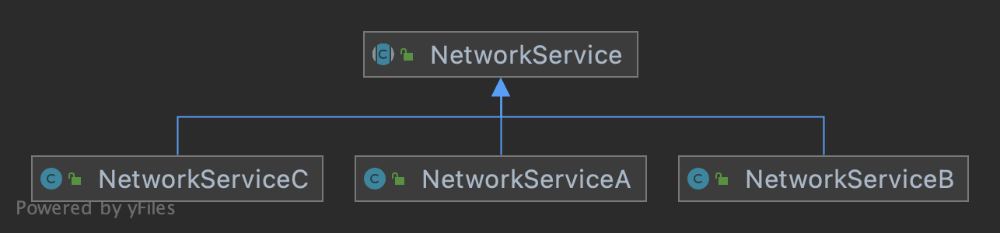
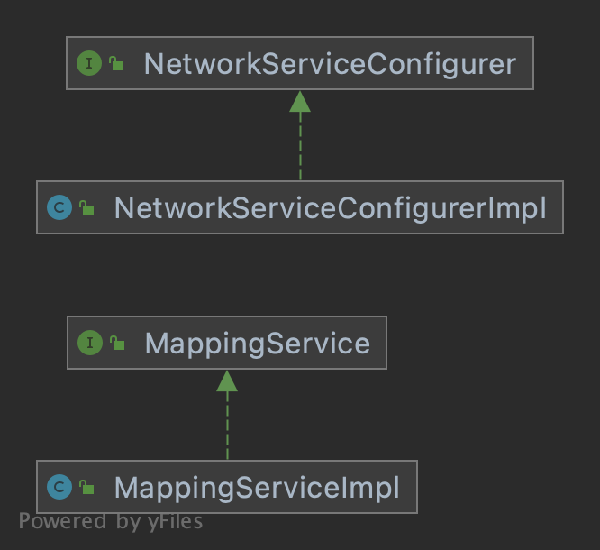

# Migration tool

Migration tool of device configurations to network services.

## Tech stack

  * Java 11
  * Spring Boot
  * Kie
  * Drools
  * JUnit
  * Lombok
  * Swagger

## Implementation

Mapping of device configuration to network service is delegated to DRL language
which application load by default from configurations and allow to change it through API.

Through API user can get information about devices, test mapping and schedule asyncronous mapping of devices to network services.

### Device configuration

Device configuration model:


Notes:
  * Each type of configuration is represented by own model class;

Services to access device configuration:



Notes:
  * Common interface to access device configuration;
  * Common code for working with configuration extracted in abstract class;
  * Logic specific for each configuration is implemented in own `impl` service;

#### Network services

Network services model:



Notes:
  * Common model class for each network service;



Notes:
  * Separation of each service in interface and implementation;


## Development

Input files: `input`

Generated output files: `app-output`

Local execution:
```
./gradlew bootRun
```

Tests execution
```
./gradlew clean test
```

# API

Swagger UI:
http://localhost:8080/swagger-ui/index.html

## Device configuration API

Query available device configuration sources:
```
curl -X GET "http://localhost:8080/api/v1/device/services" -H  "accept: */*"
```

List devices of specific model:
```
curl -X GET "http://localhost:8080/api/v1/device/service/model2" -H  "accept: */*"
```

Read device configuration:
```
curl -X POST "http://localhost:8080/api/v1/device/service/model2/device/device22" -H  "accept: */*" -d ""
```

## Configuration to NetworkService mapping API

Get current mapping logic:
```
curl -X GET "http://localhost:8080/api/v1/map/logic" -H  "accept: */*"
```

Update mapping logic:
```
curl -X POST "http://localhost:8080/api/v1/map/logic" -H  "accept: */*" -H  "Content-Type: application/json" -d "..."
```

Test mapping logic:
```
curl -X POST "http://localhost:8080/api/v1/map/run/dry?serviceId=model2&deviceId=device22" -H  "accept: */*" -d ""

```

Start mapping job
```
curl -X POST "http://localhost:8080/api/v1/map/run" -H  "accept: */*" -d ""
<job-id> will be returned
```

Check status of mapping job:
```
curl -X GET "http://localhost:8080/api/v1/map/run/get/<job-id>" -H  "accept: */*"
```

Cancel mapping job:
```
curl -X DELETE "http://localhost:8080/api/v1/map/run/cancel/<job-id>" -H  "accept: */*"
```

# Future work

 * Usage of solutions for distribuited computing in order to allow linear scaling and have HA
 * Add support for multiple mapping rules which can be operated in parallel
 * Implement more detailed view of executed tasks
 * Application package in container image
 * Expose application metrics through Prometheus interface

# License
Only for reference, distribution and/or commercial usage not allowed